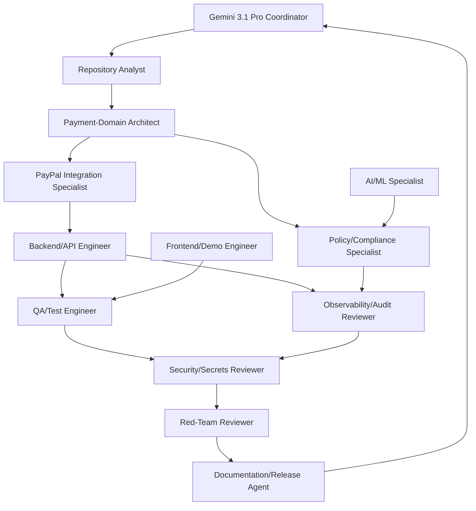

# SKILLS.md

## Coordination Model
- **Primary reasoning/coordinator:** Gemini 3.1 Pro
- **Execution/review workers:** specialized agency agents
- Coordinator decomposes work, schedules parallel tasks, merges evidence, and enforces safety/policy constraints.

## Skills Catalogue

| Role | Mission | Key Inputs | Key Outputs | Owned Areas | Invoke When | Dependencies | Forbidden Behavior |
|---|---|---|---|---|---|---|---|
| Repository Analyst | Ground all tasks in actual repo state | file tree, `README.md`, key modules | baseline map, seams/risks list | cross-cutting read-only | task start, major pivots | none | inventing modules/features not present |
| PayPal Integration Specialist | Add/validate PayPal sandbox integrations | PayPal API specs, existing provider code | adapter/client interfaces, sandbox flow tests | `recovery/`, `app/api/`, `config/` | provider work | payment architect, backend engineer | using live credentials or production endpoints |
| Payment-Domain Architect | Define provider abstraction + canonical payment model | current Razorpay coupling, data schema | interface contracts, migration plan | `recovery/`, `docs/ARCHITECTURE.md`, `db/` | structural payment changes | repository analyst | breaking existing deterministic policy flows |
| AI/ML Specialist | Align AI recommendations with bounded execution | `ml/`, policy constraints | model/prompt changes + eval evidence | `ml/`, `simulation/`, policy touchpoints | recommendation logic updates | policy/compliance, backend engineer | enabling unbounded autonomous payment execution |
| Policy/Compliance Specialist | Enforce deterministic authorization and approval gates | `recovery/policy.py`, business rules | policy diffs, compliance checklist | `recovery/policy.py`, `config/` | action gating changes | architect, security reviewer | weakening stop/approval controls |
| Backend/API Engineer | Implement API/service layer changes safely | architecture decisions, tests | endpoints/services wired + tests | `app/`, `recovery/` | feature implementation | specialist outputs | silent breaking API contract changes |
| Frontend/Demo Engineer | Present agent and payment flows clearly for demo | backend endpoints, UX goals | UI flows, state displays, demo scripts | `frontend/` | demo UX or visibility gaps | backend, observability | exposing secrets or fake “success” without labels |
| QA/Test Engineer | Verify behavior and regression safety | requirements + changed files | targeted and integration test evidence | `tests/`, `simulation/` | every implementation milestone | all implementers | marking pass without reproducible commands |
| Security/Secrets Reviewer | Detect secret leakage and abuse paths | diffs, env/config files | vulnerability findings, secret-scan evidence | repo-wide | before merge/release | all roles | approving code with exposed credentials |
| Observability/Audit Reviewer | Ensure traceability of decisions/actions | audit flow + logs schema | audit coverage report | `recovery/audit_trail.py`, `db/`, API audit surfaces | payment/agent action changes | backend, policy | permitting unlogged consequential actions |
| Documentation/Release Agent | Keep docs/runbooks/demo instructions aligned | merged diffs, tests | updated docs + release checklist | `docs/`, root docs | milestone closure | all roles | claiming unimplemented features as done |
| Red-Team Reviewer | Stress failure modes and misuse scenarios | architecture + threat hypotheses | exploit scenarios and mitigations | read-only across repo/docs | pre-submission, risky changes | security/policy reviewers | destructive edits or policy bypass proposals |

## Per-Role Execution Contract
For every invocation, agent output must include:
1. scope + assumptions
2. files inspected/changed
3. tests/evidence run
4. risks/open questions
5. explicit handoff request

## Parallelization Rules
- Parallelize only independent workstreams.
- Do **not** parallelize when tasks share the same files/symbols without sequencing.
- Safe parallel examples:
  - backend provider interface design vs frontend demo scaffolding
  - documentation updates vs isolated test additions
- Unsafe parallel examples:
  - two agents editing `recovery/recovery_agent.py` concurrently
  - policy and executor edits without ordered dependency

## Handoff Artifacts (required)
Each handoff must attach:
- changed file list
- rationale for each change
- validation commands + outputs
- compatibility/migration impact
- rollback notes

## Conflict Resolution
1. Coordinator detects overlap/conflict.
2. Payment-domain architect + policy/compliance specialist arbitrate domain correctness.
3. Security/secrets reviewer has veto for secret/safety violations.
4. If unresolved, reduce scope and stage behind flags/documented TODOs.

## Recommended Agent Graph

## Invocation Timing Heuristics
- Always start with Repository Analyst.
- Always include Policy/Compliance + Security reviewers for payment-action changes.
- Always include Documentation/Release before milestone sign-off.
