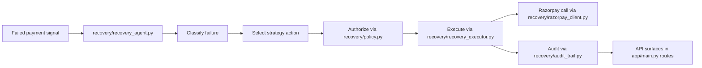
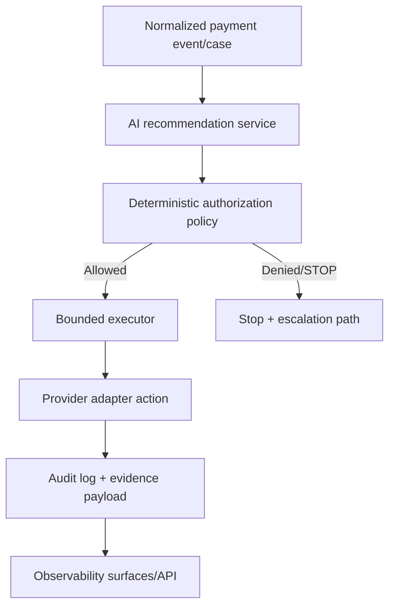
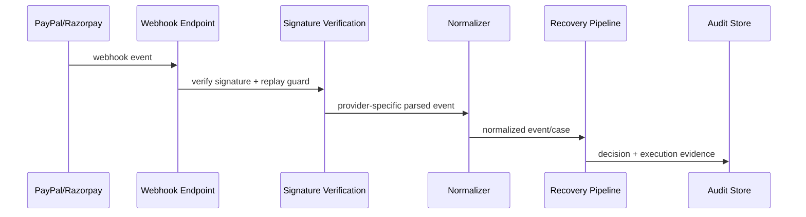

# ARCHITECTURE.md

## 1) Scope
This document describes:
1. current architecture (Razorpay-centered baseline)
2. target architecture (PayPal-ready, provider-agnostic)
3. migration seams and safety boundaries

> Current state remains Razorpay-first. PayPal integration is a target state, not completed work.

## 2) Current Directory Topology (Observed)
```text
AI-Revenue-recovery/
├── app/
│   ├── main.py
│   ├── api/
│   └── services/
├── recovery/
│   ├── recovery_agent.py
│   ├── recovery_executor.py
│   ├── razorpay_client.py
│   ├── policy.py
│   └── audit_trail.py
├── ml/
│   └── action_model.py
├── frontend/
├── db/
├── tests/
├── simulation/
├── config/
├── docs/
└── docker-compose.yml
```

## 3) Current Runtime Flow (Razorpay Baseline)


## 4) Current Domain Boundaries
- **API layer:** `app/` (FastAPI routes and app setup)
- **Recovery domain:** `recovery/` (detect/diagnose/decide/execute/audit)
- **Modeling:** `ml/` (action-conditional estimation and evaluation helpers, e.g., `ml/action_model.py`)
- **Persistence and deployment:** `db/`, `docker-compose.yml`
- **UI/demo:** `frontend/`

## 5) Razorpay Coupling (Explicit)
Primary coupling exists in:
- `recovery/razorpay_client.py` (SDK/types/errors/webhook parsing)
- `recovery/recovery_agent.py` (`RazorpayClient` wiring and live fetch path)
- `recovery/recovery_executor.py` (retry order creation assumptions)
- tests such as `tests/test_razorpay_webhook.py`

## 6) Target PayPal-Ready Architecture

### 6.1 Target Directory Shape (Additive)
```text
recovery/
├── providers/
│   ├── base.py                 # Provider interface contract
│   ├── razorpay_provider.py    # Adapter around existing razorpay_client.py
│   └── paypal_provider.py      # PayPal sandbox adapter (OAuth + APIs)
├── models/
│   └── payment_normalized.py   # Canonical payment/webhook/action schema
├── webhook/
│   └── ingest.py               # idempotent normalized webhook ingestion
└── ...existing modules...
```

### 6.2 Provider Abstraction Design
Provider interface should cover:
- fetch failed/pending recoverable items
- create retry/payment/order operations
- fetch entity status
- parse and verify webhook events
- map provider status/error fields into canonical normalized model

### 6.3 Normalized Payment Model
Canonical fields (example):
- `provider` (`razorpay|paypal`)
- `provider_payment_id`, `provider_order_id`, `provider_subscription_id`
- `amount_minor`, `currency`, `status_normalized`
- `failure_category`, `failure_reason_code`
- `customer_ref`, `created_at`, `updated_at`
- `raw_payload` (for audit/debug)

### 6.4 AI + Policy + Bounded Execution Flow


### 6.5 Webhook Flow (Target)


## 7) Data Model Evolution
- Keep existing schema stable where possible.
- Add provider-neutral columns/tables for:
  - canonical payment state transitions
  - webhook deliveries (idempotency keys, delivery timestamps)
  - policy decisions and approval metadata
- Preserve backward compatibility for current Razorpay-derived audit evidence.

## 8) Frontend Surfaces (Target)
- Provider-labeled case feed (Razorpay vs PayPal sandbox)
- Recovery timeline with decision reason + policy result + execution result
- Approval-gated actions (explicit human confirmation)
- Demo toggles for simulation/sandbox modes

## 9) Deployment Topology
Current: local Docker compose (`docker-compose.yml`) with backend/frontend/PostgreSQL.
Target: same topology with provider-specific env vars isolated by mode:
- simulation defaults
- sandbox keys via env/secret manager
- production values excluded from repository and disabled in demo branches

## 10) Trust & Safety Boundaries
- `ml/` may recommend; it must not directly execute payment actions.
- `recovery/policy.py` authorizes actions deterministically.
- executor acts only on authorized actions.
- all consequential actions require audit records and human-approval controls for real-money risk.
